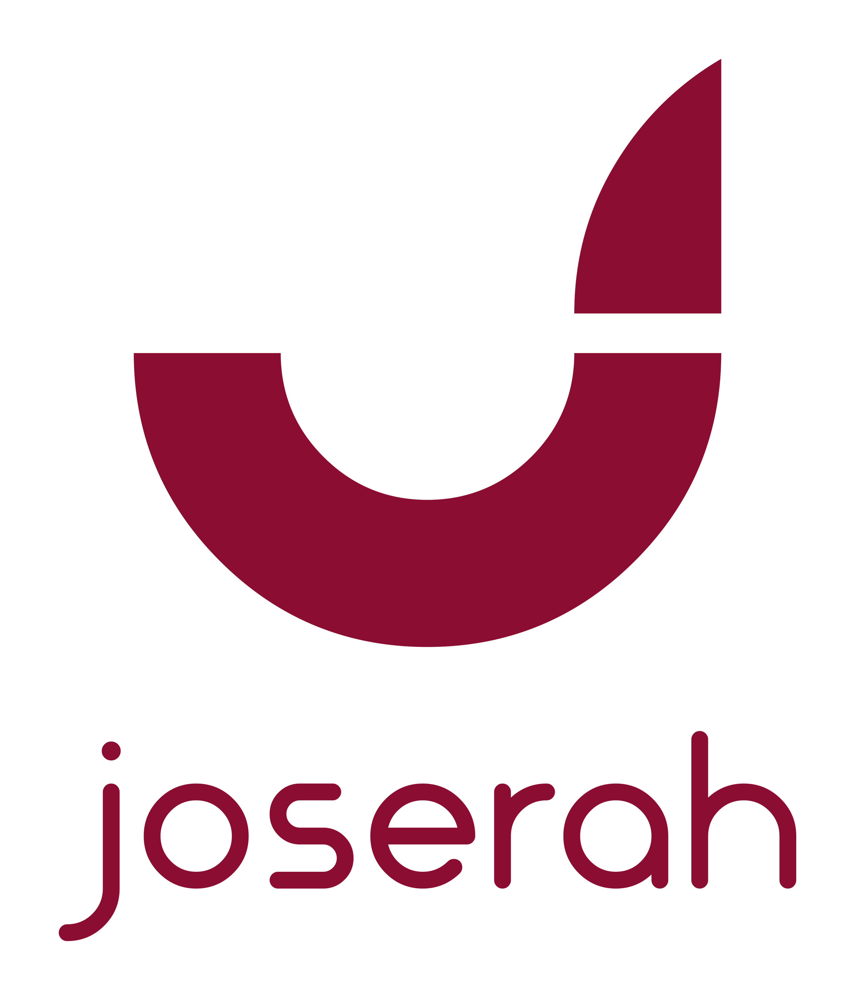

# Joserah

**A memory for your AI assistant, made of files you own.**

*Pronounced "Yosera."*

Claude forgets you between sessions. Joserah is the folder that remembers —
a daily journal, your open work, the people around it, and the preferences
Claude picks up about how you like to work. Plain markdown, on your disk, in
your language. No database, no account, no lock-in: if you stop using this
tomorrow, you still have every file.

---

## Install

```
/plugin marketplace add SerVian7/joserah
/plugin install joserah@joserah
```

Then create your workspace:

```
/joserah:install
```

It asks where to put it and what language to speak to you in, sets everything
up, and hands you to `/joserah:onboard` — an interview that fills the
workspace in a few questions at a time, across as many sessions as you like.

Already have years of notes lying around? `/joserah:import` takes the pile.

## What you get

| | |
|---|---|
| **A journal that writes itself** | Today's entry is created and read into every session. You never open it on purpose. |
| **Capture without commands** | Say "remind me" or "kaydet" mid-sentence and it lands in your inbox, timestamped. |
| **Context that arrives on its own** | Open tasks and recent decisions are in the session before you type. |
| **A workspace that explains itself** | Its `AGENTS.md` tells any assistant how to behave in it — routines included. Works with Claude Code today; the format is model-agnostic on purpose. |

## The four skills

| | |
|---|---|
| `/joserah:install` | Create a workspace where you want it |
| `/joserah:onboard` | Get interviewed; the workspace fills in. Stop and resume freely |
| `/joserah:import` | Bring in existing notes, exports, document piles |
| `/joserah:doctor` | Check a workspace is healthy, and repair it |

## How it works

A workspace is any folder holding a `.joserah/config.json`. The plugin's hooks
look for that marker and stay quiet everywhere else — so you install Joserah
once, keep as many workspaces as you like, and updating the plugin updates all
of them at once.

Two rules keep the knowledge honest. Source material you bring in is copied
**verbatim** into `knowledge/raw/` and never edited; anything the assistant
writes lives elsewhere and cites the source it came from. A knowledge base
that quotes its own guesses back at you is worse than no knowledge base.

## Requirements

- Claude Code
- Node.js 18 or newer on your `PATH`
- **On Windows: [Git for Windows](https://git-scm.com/download/win)**, which
  provides the `bash` the hooks are executed with. Without it the hooks do not
  run and the automatic parts of Joserah stay silent.
- The [superpowers](https://github.com/obra/superpowers) plugin — declared as
  a dependency, so it should arrive with Joserah. If it did not:
  `/plugin marketplace add anthropics/claude-plugins-official`, then
  `/plugin install superpowers@claude-plugins-official`

Windows, macOS and Linux. Claude Code runs every hook command through a shell,
so Joserah's hooks declare `"shell": "bash"` and give Node an absolute script
path — one command string that behaves the same on all three platforms, given
a bash to run it in.

## Brand

Burgundy `#8B0D32`. No vector source exists for this mark — the Drive folder
that holds it has no SVG or AI file, only the PNGs in `assets/`.

## What is coming

A visual layer over the same files — the workspace as something you can look
at, not only talk to. The files stay the source of truth either way; that is
the whole point of keeping them plain.

## Licence

MIT for the code. The Joserah name and logo are not part of that grant.
